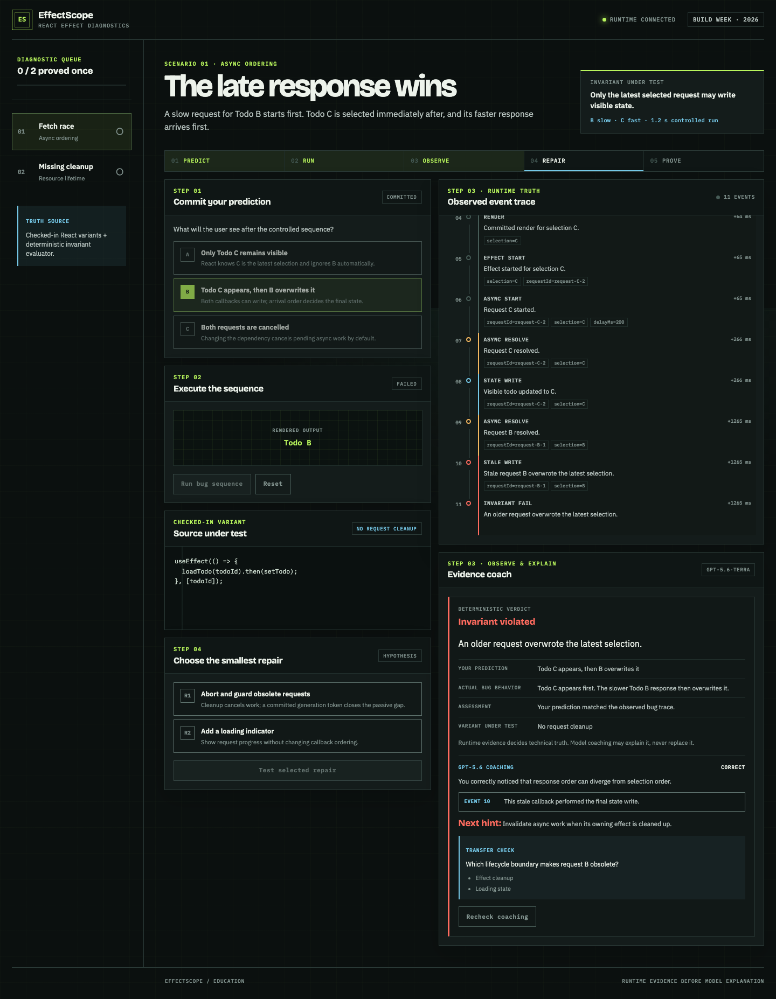
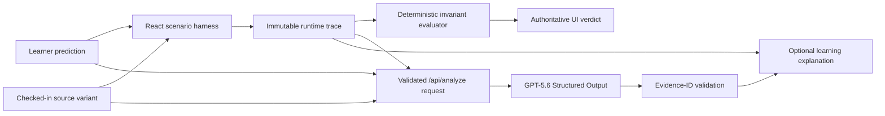

# EffectScope

**Predict what a React effect will do. Run the real component. Repair the bug
from evidence.**

EffectScope is an interactive React learning lab built for the Education track
of OpenAI Build Week. It records an actual instrumented React execution,
evaluates the invariant deterministically, then asks GPT-5.6 to explain the
learner's mental-model gap using exact trace events.



## Why it is different

Most effect explanations start from source and ask a model to infer what React
did. EffectScope reverses that trust boundary:

1. checked-in React variants execute in controlled scenario harnesses;
2. immutable trace events record render, effect, cleanup, async, timer, and state
   transitions;
3. a deterministic evaluator decides pass or fail;
4. GPT-5.6 receives the validated attempt and explains it, but cannot replace the
   runtime verdict or cite evidence absent from the trace.

No arbitrary code execution, free-form prompt, account, or database is involved.

## 60-second test path

1. Open **Fetch race**.
2. Predict **“Todo C appears, then B overwrites it.”**
3. Run the bug sequence and inspect `state_write(C)`, `stale_write(B)`, and the
   failed invariant.
4. Optionally ask GPT-5.6 for trace-grounded coaching.
5. Select **“Abort and guard obsolete requests.”**
6. Test the repair and verify `cleanup`, `abort`, ignored obsolete work, and the
   proved invariant.

Repeat with **Missing cleanup** to see a timer outlive its first component and to
prove that effect cleanup restores single ownership.

## Scenarios

| Scenario | Bug | Effective repair | Deliberate distractor |
|---|---|---|---|
| Fetch race | Old response overwrites current state | Abort plus committed-generation guard | Loading indicator only |
| Missing cleanup | Old interval survives replacement mount | Clear interval in effect cleanup | Start another interval |

Every variant has a checked-in ID, visible source snippet, real React behavior,
and Golden Trace coverage.

## Architecture



The browser owns scenario execution and deterministic feedback. The serverless
API revalidates scenario ownership, source variant, repair, trace structure, and
invariant result before calling OpenAI. Full design: [architecture](./docs/ARCHITECTURE.md).

## GPT-5.6 usage

- Official OpenAI Node SDK and Responses API
- Default model `gpt-5.6-terra`; server rejects models outside the GPT-5.6 family
- Structured Outputs generated from a strict Zod schema
- Server-loaded scenario copy and source; client event prose is excluded from
  model input
- One to three evidence IDs, each revalidated against the submitted trace
- `store: false`, 700 output-token ceiling, ten-second total timeout, at most one
  retry, bounded request body, and application-level rate limiting
- Explicit user action only; identical attempts use a browser cache
- Deterministic lab remains fully usable when model coaching fails or is absent

Security and trust boundaries: [model boundary](./docs/SECURITY.md).

## Built with Codex

Codex developed the repository, React harnesses, adversarial scheduler tests,
product UI, API boundary, documentation, and browser proofs in primary task
`019f7444-a17c-7b51-b05e-eff373c05fbd`.

After each major milestone, independent GPT-5.6 Sol xhigh subagents reviewed
separate correctness, architecture, security, accessibility, and test concerns.
Every P0–P2 finding was fixed and re-reviewed before work continued. Commit and
review evidence lives in the [Build Log](./docs/BUILD_LOG.md).

### Build Week delta

- Imported baseline: commit `79075f8`
- New work: trace domain, two actual React scenario harnesses, six source
  variants, deterministic Oracles, diagnosis workspace, GPT-5.6 coach boundary,
  80+ unit/contract tests, and Chromium E2E suite
- Baseline provenance: [BASELINE.md](./BASELINE.md)
- Publication authorization: [OWNERSHIP.md](./OWNERSHIP.md)

## Requirements

- Node.js 22.13–22.x or Node.js 24+
- npm 10+

```bash
nvm use
npm ci
```

## Local development

Deterministic frontend only:

```bash
npm run dev
```

Frontend plus serverless `/api/analyze` route:

```bash
cp .env.example .env.local
# Add OPENAI_API_KEY to .env.local; never use a VITE_ variable.
npx vercel dev
```

Without `OPENAI_API_KEY`, both learning loops work and the optional coach shows
a controlled fallback.

## Verification

```bash
npm run check
npx playwright install chromium
npm run test:e2e
npm audit --audit-level=high
```

`npm run check` runs lint, all Vitest unit/component/API contract tests, TypeScript,
and the production build. GitHub Actions also runs the Chromium E2E suite.

## Deployment

`vercel.json` configures the Vite output and 15-second serverless budget. Set
`OPENAI_API_KEY`, optionally set a GPT-5.6 `OPENAI_MODEL`, configure project
spend/rate controls, then deploy through Vercel. Run the production checklist in
[SUBMISSION_CHECKLIST.md](./docs/SUBMISSION_CHECKLIST.md) before publishing.

## Privacy and limits

- Attempt data is sent only after the learner presses the coaching button.
- No names, accounts, arbitrary source, or free-form messages are collected.
- OpenAI requests use `store: false`.
- In-memory rate limiting is a backstop, not a distributed quota system.
- Browser execution demonstrates controlled teaching scenarios, not arbitrary
  application debugging.

## Project records

- [PLAN.md](./PLAN.md) — accepted implementation and submission plan
- [REVIEW.md](./REVIEW.md) — independent plan review and disposition
- [docs/BUILD_LOG.md](./docs/BUILD_LOG.md) — commits, tests, and review trail
- [docs/DEPENDENCIES.md](./docs/DEPENDENCIES.md) — direct licenses and font provenance
- [docs/DEMO_SCRIPT.md](./docs/DEMO_SCRIPT.md) — sub-three-minute video script
- [docs/DEVPOST.md](./docs/DEVPOST.md) — ready-to-paste submission copy

## License

MIT. See [LICENSE](./LICENSE). Human ownership and publication confirmation is
recorded in [OWNERSHIP.md](./OWNERSHIP.md).
