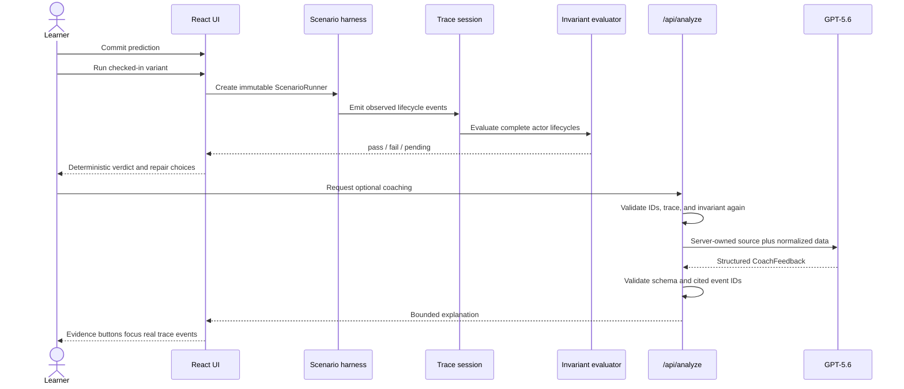

# EffectScope architecture

## Core invariant

The model never decides what React did. A real React harness emits normalized
events; a pure evaluator derives the technical verdict. GPT-5.6 only explains a
validated attempt.

## Runtime flow

## Modules and ownership

| Boundary | Responsibility | Must not do |
|---|---|---|
| `src/domain` | immutable trace, runner lifecycle, pure invariant evaluation | render UI or call model |
| `src/scenarios` | actual React behavior, checked-in source variants, Golden Traces | decide pedagogy from model text |
| `src/features/diagnose` | accessible prediction, trace, repair, and coach presentation | invent runtime events |
| `src/infrastructure` | schedulers, client API contract, shared validation schema | accept arbitrary source or prompts |
| `api/analyze.ts` | server revalidation, OpenAI request, abuse controls, safe response | expose credentials or determine browser state |

## Scenario execution

`ScenarioRunner` binds scenario, variant, scheduler, and trace into one immutable
run identity. `finish()` tears down scheduled work before publishing the terminal
event. `dispose()` abandons a run without inventing a verdict. Both block later
events.

Fetch Race uses a browser scheduler with a shared release epoch. React still
starts each effect, while controlled request latency remains causal after tab
throttling or a long main-thread stall. Missing Cleanup follows committed
mount/unmount evidence; leaked timers remain evidence but cannot orchestrate UI
lifecycle.

## Trust boundaries

Browser input is untrusted even though current UI offers fixed controls. Server
accepts only two scenario IDs and six registered variants. It verifies prediction
and repair ownership, contiguous unique trace events, terminal-event placement,
and a fresh invariant evaluation. Source and scenario instructions are loaded
from server modules.

The model receives event ID, sequence, kind, actor, and bounded scalar data. It
does not receive client event prose. Structured output is parsed locally and
every evidence ID must exist exactly once in the submitted trace.

## Failure behavior

- Reset, scenario switch, and new run dispose scenario work and abort browser
  analysis.
- Client disconnect is combined with the server timeout and propagated to the
  OpenAI request.
- Timeout, unavailable configuration, invalid output, and upstream failure return
  generic bounded errors.
- Model failure never removes the deterministic verdict, trace, or repair loop.

## Verification layers

1. Golden Trace tests: all bug, fix, and distractor variants.
2. Adversarial domain tests: lifecycle order, reentrancy, cancellation, overflow,
   Strict Mode, and immutable snapshots.
3. Component tests: prediction gate, reset/switch, repair/source alignment, focus,
   and trace-derived feedback.
4. API tests: request forgery, source ownership, evidence validation, rate limits,
   cancellation, timeout, and safe errors.
5. Chromium E2E: both scenario loops, both coach paths, failure/caching/abort,
   long main-thread stall, keyboard focus, and mobile overflow.
